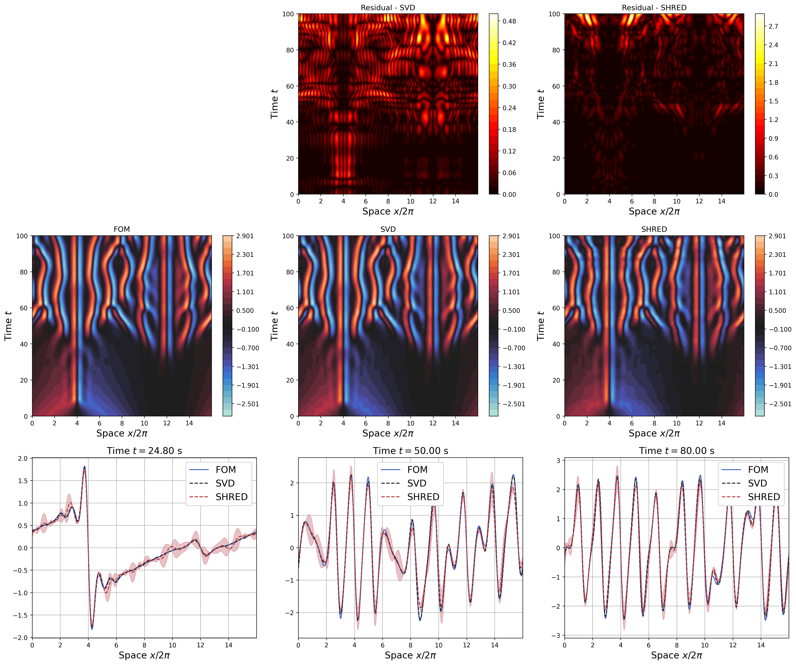

# SHRED-ROM

This repository contains the official source code implementation of the paper *---title---*

`utils` folder contains auxiliary functions to process and plot data, as well as to define and train the SHRED model. These functions are mainly based on the [pyshred](https://github.com/Jan-Williams/pyshred) repository developed by [Jan Williams](https://github.com/Jan-Williams)

## Kuramoto-Sivashinsky
The folder `KuramotoSivashinsky` contains the implementation of the Kuramoto-Sivashinsky test case where we reconstruct the high-dimensional field, starting from few sensor data while considering different initial conditions and noisy measures. Due to the low training cost of the SHRED architecture, we can train different SHRED models for different sparse sensors and produce a more-reliable reconstruction of the high-dimensional field, in terms of mean and variance, by averaging the predictions of the different models. This becomes useful when the sensors are sparse and the measures is noisy. The cases with and without padding are considered.

  
   

## Pinball
`Pinball.ipynb` presents the pinball test case where we reconstruct the high-dimensional density, whose dynamics is described by the Fokker-Planck equation, starting from few sensor data while considering different velocities of the three rotating cylinders

  
   

## Flow around an obstacle
`FlowAroundObstacle.ipynb` presents the flow around an obstacle test case where we reconstruct the high-dimensional velocity, whose dynamics is described by the unsteady Navier-Stokes equation, starting from few sensors data while considering different inflow conditions and obstacle geometries

  
   

