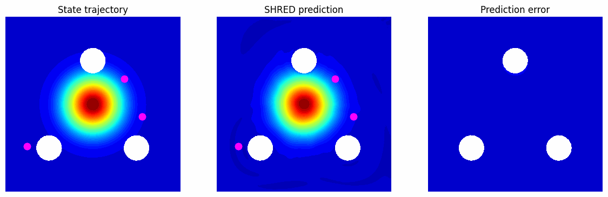
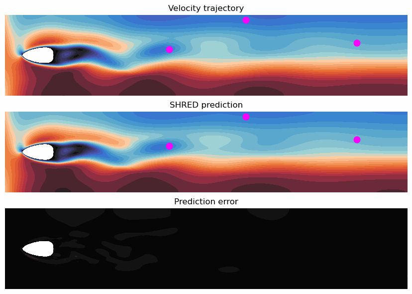

# SHRED-ROM

This repository contains the official source code implementation of the paper *title*

`utils` folder contains auxiliary functions to process and plot data, as well as to define and train the SHRED model. These functions are mainly based on the [pyshred](https://github.com/Jan-Williams/pyshred) repository developed by [Jan Williams](https://github.com/Jan-Williams)

## Kuramoto-Sivashinsky

## Pinball
`Pinball/Pinball.ipynb` presents the pinball test case where we reconstruct the high-dimensional density, whose dynamics is described by the Fokker-Planck equation with transport term computed via steady Navier-Stokes equations, starting from few sensor data. Different velocities of the three rotating cylinders are considered.

  
   

## Flow around an obstacle
`FlowAroundObstacle/FlowAroundObstacle.ipynb` presents the flow around an obstacle test case where we reconstruct the high-dimensional velocity, whose dynamics is described by the unsteady Navier-Stokes equation, starting from few sensors data. Different inflow conditions and obstacle geometries are considered.

  
   

