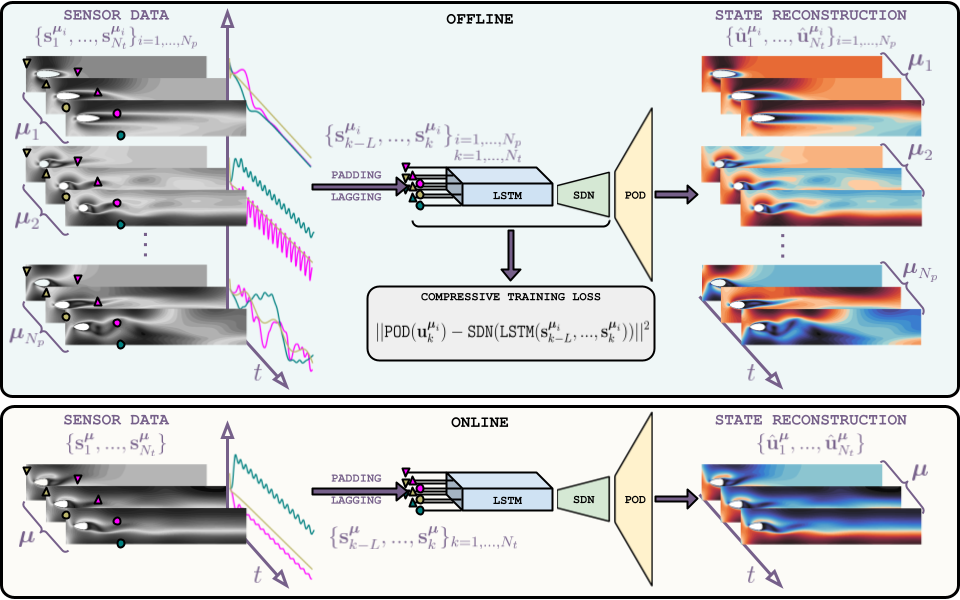

# Reduced order modeling with shallow recurrent decoder networks

#[](https://arxiv.org/)
#[](https://doi.org/10.5281/zenodo.14524524)

## Overview
<p align="center" width="100%">
  
  <br />
</p>


*SHallow REcurrent Decoder-based Reduced Order Model* (SHRED-ROM) is an ultra-hyperreduced order modeling framework aiming at reconstructing high-dimensional data from limited sensor measurements in multiple scenarios. Thanks to a composition of Long-Short Term Memory network (LSTM) and a Shallow Decoder Network (SDN), SHRED-ROM is capable of
- Reconstructing high-dimensional data (such as synthetic or video data) from sparse sensor measurements in new scenarios unseen during training, regardless of sensor placement,
- Dealing with both physical, geometrical and time-dependent parametric dependencies, while being agnostic to the paraemter values,
- Estimating unknown parameters,
- Coping with both fixed or mobile sensors.
  
Importantly, computational efficiency and memory usage are enhanced by reducing the dimensionality of full-order snapshots, allowing for compressive training of the networks, with minimal hyperparameter tuning and laptop-level computing.


## Quickstart

```python
import torch
import numpy as np
from sklearn.utils.extmath import randomized_svd
from utils.processdata import mre, num2p                  # Error metrics and format
from utils.processdata import Padding, TimeSeriesDataset  # Data preprocessing
from utils.models import SHRED, fit                       # SHRED-ROM model and training
```

```python
# Generate or import data

states = ... # Generate or import the state snapshots as a torch.tensor with shape [nparameters, ntimesteps, nstate]
sensors = ... # Generate, import or extract the sensor data as a torch.tensor with shape [nparameters, ntimesteps, nsensors]
nparameters, ntimesteps, nstate = states.shape 
nsensors = sensors.shape[2]
```

```python
# Train-validation-test splitting

np.random.seed(0)
ntrain = round(0.8 * nparameters)
idx_train = np.random.choice(nparameters, size = ntrain, replace = False)
mask = np.ones(nparameters)
mask[idx_train] = 0
idx_valid_test = np.arange(0, nparameters)[np.where(mask!=0)[0]]
idx_valid = idx_valid_test[::2]
idx_test = idx_valid_test[1::2]
nvalid = idx_valid.shape[0]
ntest = idx_test.shape[0]
```

```python
# Proper Orthogonal Decomposition

r = ... # Define the number of POD modes
U, S, V = randomized_svd(states[idx_train].reshape(-1, nstate).numpy(), n_components = r) 
states_POD = states @ V.transpose()
```

```python
# Padding and lagging

lag = ... # Define the lag parameter

train_data_in = Padding(sensors[idx_train], lag)
valid_data_in = Padding(sensors[idx_valid], lag)
test_data_in = Padding(sensors[idx_test], lag)

train_data_out = Padding(states_POD[idx_train], 1).squeeze(1)
valid_data_out = Padding(states_POD[idx_valid], 1).squeeze(1)
test_data_out = Padding(states_POD[idx_test], 1).squeeze(1)

train_dataset = TimeSeriesDataset(train_data_in, train_data_out)
valid_dataset = TimeSeriesDataset(valid_data_in, valid_data_out)
test_dataset = TimeSeriesDataset(test_data_in, test_data_out)
```

```python
# SHRED-ROM training

shred = SHRED(nsensors, r, hidden_size = 64, hidden_layers = 2, decoder_sizes = [350, 400], dropout = 0.1)
train_errors, valid_errors = fit(shred, train_dataset, valid_dataset, batch_size = 64, epochs = 100, lr = 1e-2, verbose = True, patience = 10)
```

```python
# SHRED-ROM evaluation

shred.freeze()
states_POD_test_hat = shred(test_data_in)
states_POD_test_hat = (states_POD_test_hat @ V).reshape(ntest, ntimesteps, nstate)
print("Mean relative SHRED-ROM reconstruction error: %s." % num2p(mre(states[idx_test], states_POD_test_hat)))
```

## Data

The *data* can be downloaded from [https://doi.org/10.5281/zenodo.14524524](https://doi.org/10.5281/zenodo.14524524)

## Utilities

`utils` folder contains auxiliary functions to preprocess and plot data, as well as to define and train SHRED-ROM. These functions are mainly based on the [pyshred](https://github.com/Jan-Williams/pyshred) repository developed by [Jan Williams](https://github.com/Jan-Williams). 

## Shallow Water
`SWE.ipynb` presents the Shallow Water test case where we reconstruct the high-dimensional velocity on a sphere, whose dynamics is described by the Shallow Water Equations, starting from few sensor data.

<p align="center" width="100%">
  
  <br />
</p>

## GoPro physics
`GoPro.ipynb` presents GoPro physics test case where we reconstruct high-dimensional videos starting from few pixel data.

<p align="center" width="100%">
  
  <br />
</p>

## Kuramoto-Sivashinsky
`KuramotoSivashinsky.ipynb` presents the Kuramoto-Sivashinsky test case where we reconstruct the high-dimensional state, whose dynamics is described by the Kuramoto-Sivashinsky equation, starting from few sensor data while considering different viscosities and initial conditions.

<p align="center" width="100%">
  
  <br />
</p>

## Fluidic pinball
`Pinball.ipynb` presents the fluidic pinball test case where we reconstruct the high-dimensional density, whose dynamics is described by the advection-diffusion partial differential equation, starting from few sensor data while considering different velocities of the three rotating cylinders.

<p align="center" width="100%">
  
  <br />
</p>

## Flow around an obstacle
`FlowAroundObstacle.ipynb` presents the flow around an obstacle test case where we reconstruct the high-dimensional velocity, whose dynamics is described by the unsteady Navier-Stokes equations, starting from few sensor data while considering different inflow conditions and obstacle geometries.

<p align="center" width="100%">
  
  
  <br />
</p>
